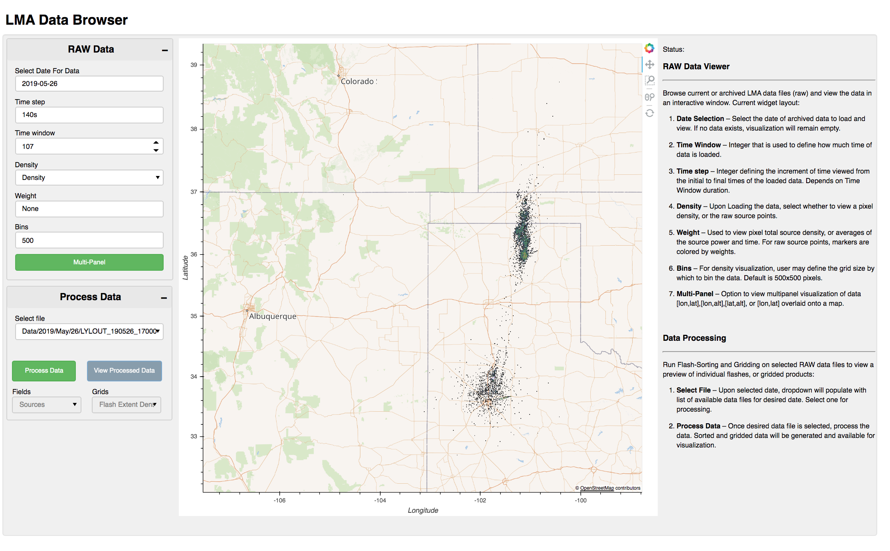

LMA Data Browser
---------------

This web application serves as an alternative to the out-of-the-box data browser that is used to view archived raw (.dat) LMA files.

Using the Holoviz Panels package, this LMA data browser allows for a more customizable, and user friendly data exploration. To get rid of the hassle of viewing data on more dated image, this browser allows for specific 
data time selections, map overlays, point-source and grid plotting, and even data processing and flash-sorting.

Requirments:
xlma-python  -- For LMA flash sorting and gridding

Note: This Project remains a work in progress. 
Wishlist: Data/Loading/Plotting Indicators 
          Basemap Selection
          Remove Flash-Sorting Points -- Keep grids
          Update Processing Widget Callbacks

Screenshots:

